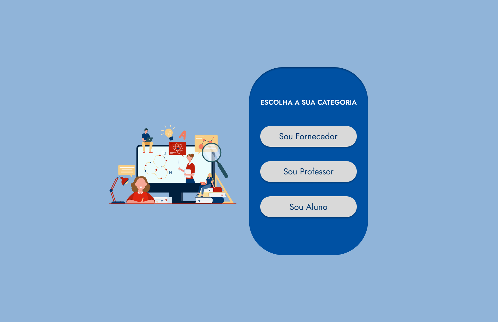
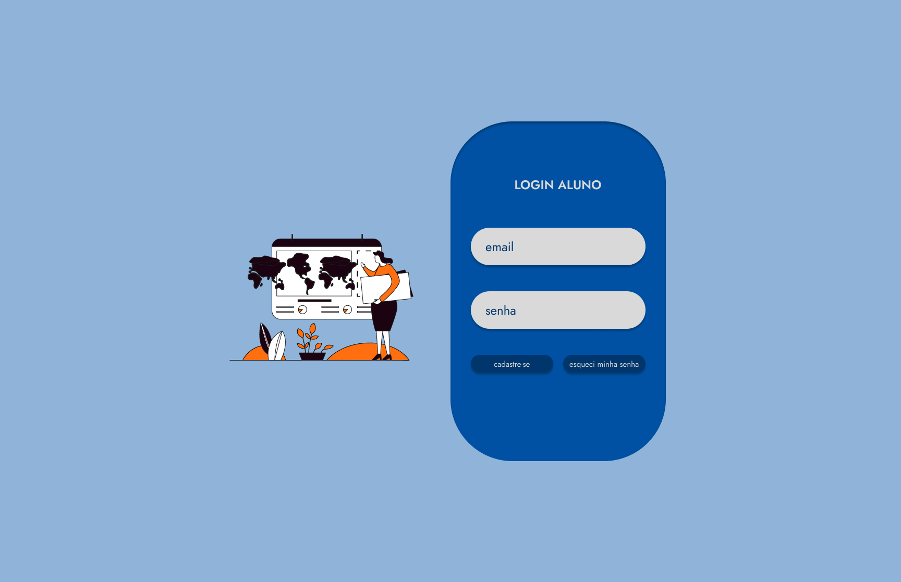
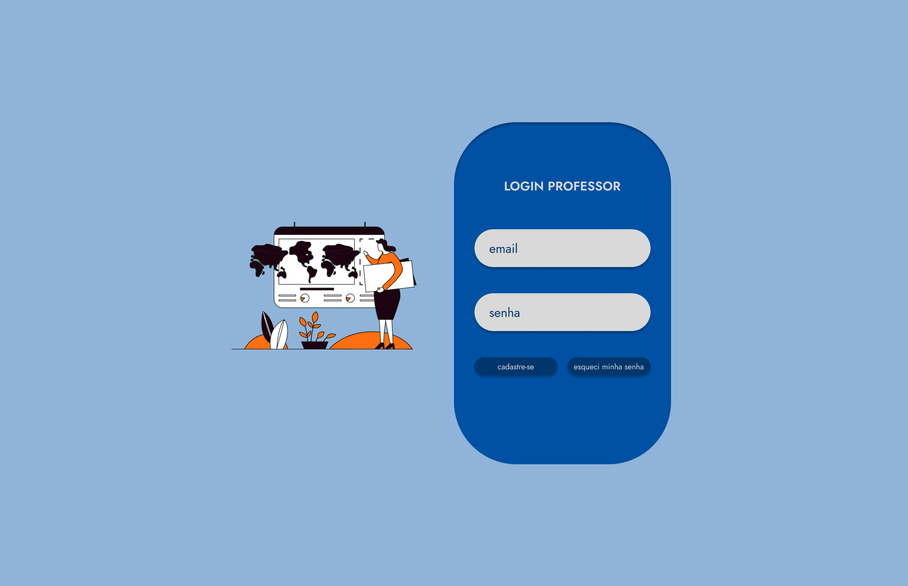
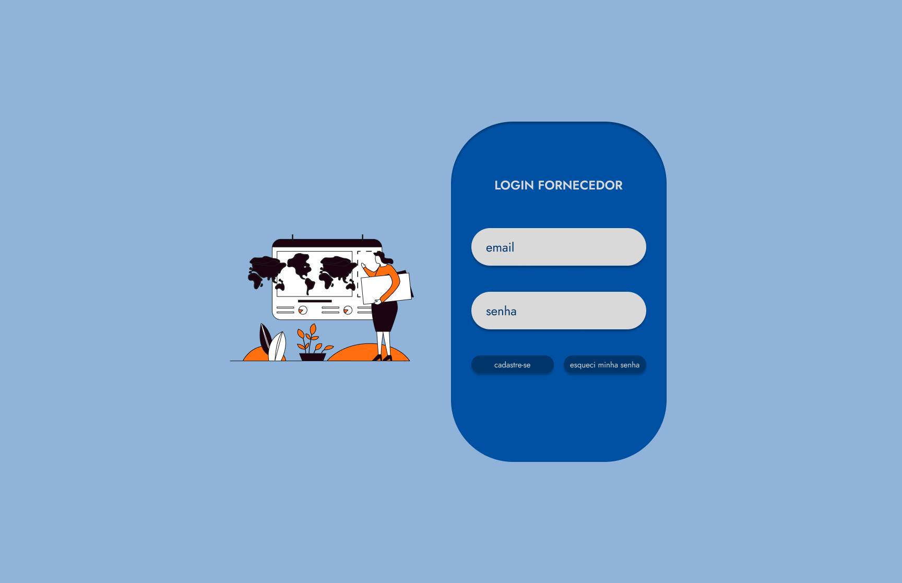

# LOGIN

Telas relativas ao login.

## LANDING PAGE

  

### IR PARA

[LOGIN ALUNO](#login-aluno)  
[LOGIN PROFESSOR](#login-professor)  
[LOGIN FORNECEDOR](#login-fornecedor)  

## LOGIN ALUNO

  

### IR PARA

[CADASTRO](cadastro.md#cadastro-de-aluno)  
[ESQUECI A SENHA](senha.md)  
[AREA LOGADA](area.md#area-do-aluno)  

## LOGIN PROFESSOR

  

### IR PARA

[CADASTRO](cadastro.md#cadastro-de-professor)  
[ESQUECI A SENHA](senha.md)  
[AREA LOGADA](area.md#area-do-professor)  

## LOGIN FORNECEDOR

  

### IR PARA

[CADASTRO](cadastro.md#cadastro-de-fornecedor)  
[ESQUECI A SENHA](senha.md)  
[AREA LOGADA](area.md#area-do-fornecedor)  
